# 1 Structural tests
Made for testing the structure and the functioning of the system, these tests cover the results of basic interactions between the user and the system, not testing the systems functionalities and its outputs

## 1.1 Positive tests
These tests are made for ensuring whether the this software works properly when the user interacts with it in ways they are supposed to

### 1.1.1 Scenario: Successful login with valid credentials
- **Given** The user runs the software
- **When** The user enters "user" as the username and "senha" as the password 
- **Then** The user is granted access to the system
- **And** The user sees the message "Bem vindo ao sistema de configuração de rede"
- **Ando** The user sees a ">" sign which indicates they can now  enter commands

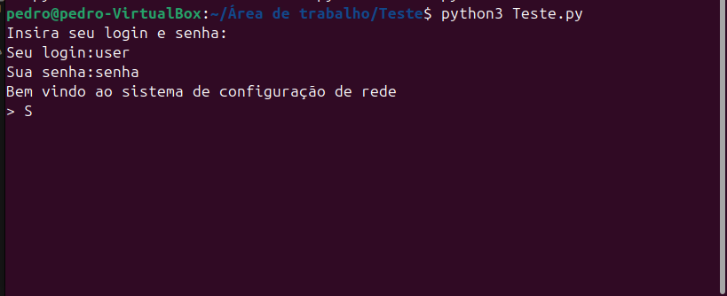

### 1.1.2 Scenario: System Exit  
- **Given** the user is successfully logged into the system  
- **When** the user enters "sair"  
- **Then** the system should display "Saindo..."
- **And** the system should exit

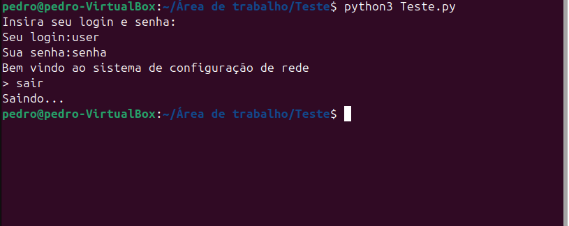
    
## 1.2 Negative tests
Tests made for ensuring the system behaves properly when the user interacts with it in ways that are not part of the main user experience workflow

### 1.2.1 Scenario: Trying to login with invalid credentials
- **Given** The user starts the system
- **When** The user enters values other than "user" as the username or "senha" as the password 
- **Then** The user sees the error message "Dados inválidos"
- **And** The user is not granted access to the system

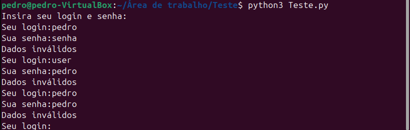

### 1.2.2 Scenario: Trying to exit from login screen  
- **Given** the user runs the software
- **When** the user enters "sair" instead of credentials  
- **Then** the system should exit immediately

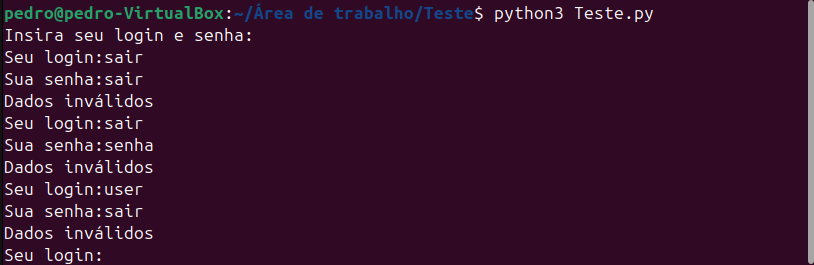

# 2 Functional tests
Made for testing the functionalities of the system, these tests cover the outputs of interactions with its functions. To test this network configuration system, the functional tests cover mainly the results of entering the commands in various different ways.

Positive testing verifies that the software under test performs as the requirements specify. It ensures that the functionality does what it is expected to do. Positive test cases verify that when the function under test is exercised using valid input, the input is accepted and the user is able to proceed with the flow.

## 2.1 Positive tests
These tests are made for ensuring whether the functionalities of this software work properly when given valid input

### 2.1.1 Scenario: Show network interfaces  
- **Given** the user is logged into the system  
- **When** the user executes the command "mostrar interfaces"  
- **Then** the user should see all network interfaces listed alphabetically with their details  

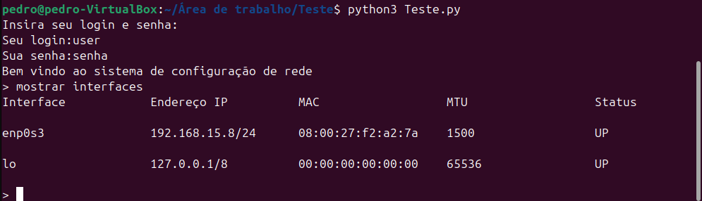

### 2.1.2 Scenario: Configure IP  
- **Given** the user is logged into the system  
- **When** the user executes the command "configurar enp0s3 como 192.168.0.1/24"  
- **Then** the user should see the message "IP 192.168.0.1/24 configurado com sucesso na interface enp0s3."  

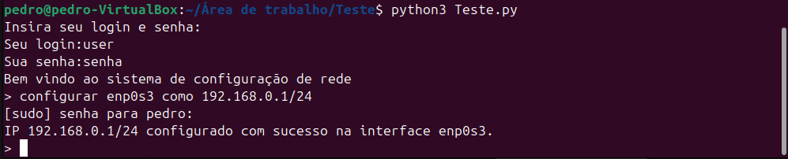

### 2.1.3 Scenario: Configure IP with Edge Masks  
- **Given** the user is logged into the system  

    #### 2.1.3.1 Sub-Scenario: Configure with minimum valid mask  
    - **When** the user executes the command "configurar enp0s3 como 192.168.0.1/0"  
    - **Then** the user should see the message "IP 192.168.0.1/0 configurado com sucesso na interface enp0s3"  
    
    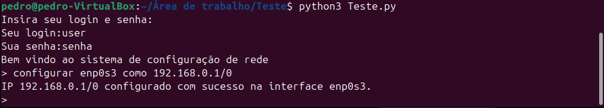

    #### 2.1.3.2 Sub-Scenario: Configure with maximum valid mask  
    - **When** the user executes the command "configurar enp0s3 como 192.168.0.1/32"  
    - **Then** the user should see the message "IP 192.168.0.1/32 configurado com sucesso na interface enp0s3"  

    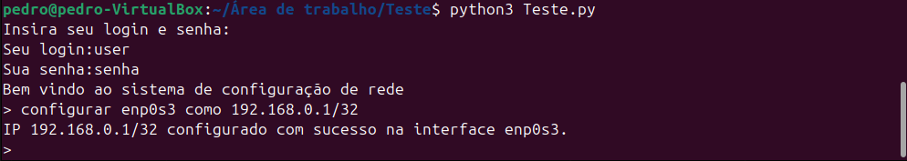
    
### 2.1.4 Scenario: Show interfaces with multiple IP addresses  
- **Given** the user is logged into the system  
- **When** the user configures multiple IPs on interface "enp0s3"  
- **And** the user executes the command "mostrar interfaces"  
- **Then** the user should see the interface "enp0s3" with all configured IPs listed  

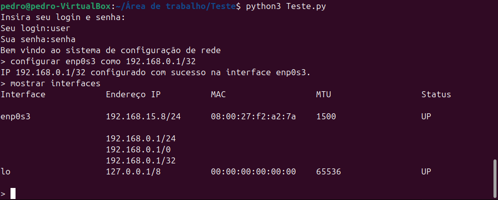

### 2.1.5 Scenario: Show interfaces without IP addresses  
- **Given** the user is logged into the system  
- **When** the user executes the command "mostrar interfaces"  
- **Then** the user should see empty interfaces with "Vazio" in the IP column  

### 2.1.6 Scenario: Sequential commands  
- **Given** the user is logged into the system  
- **When** the user executes the following commands sequentially  
  - | mostrar interfaces
  - | configurar enp0s3 como 192.168.1.1/24
- **Then** each command should execute successfully without errors  

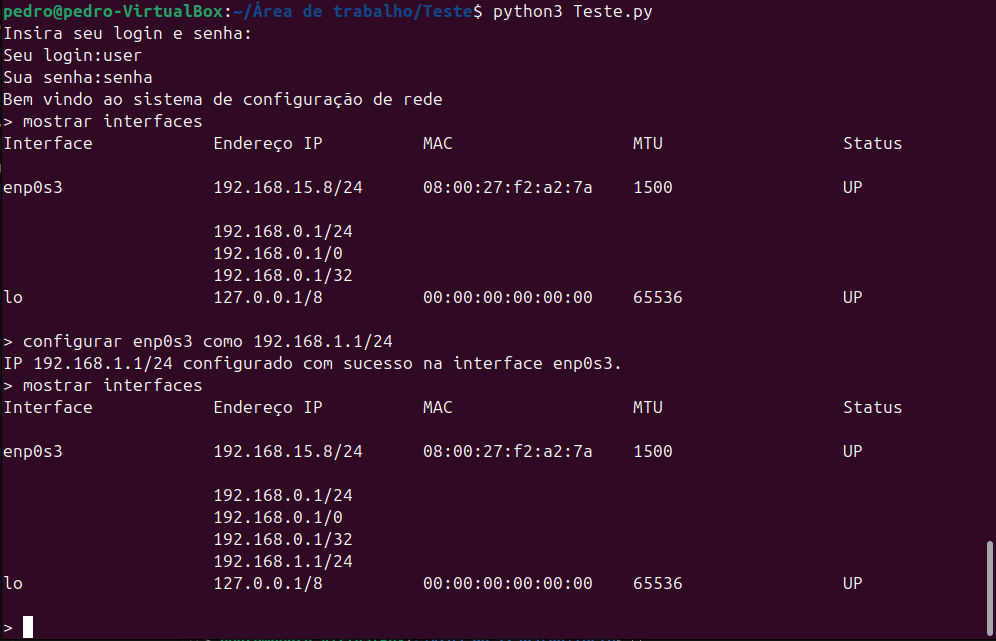

### 2.1.7 Scenario: Show interfaces after configuration  
- **Given** the user is logged into the system  
- **When** the user configures "enp0s3" with "192.168.1.1/24"  
- **And** the user executes the command "mostrar interfaces"  
- **Then** the user should see the address "192.168.1.1/24" listed under "enp0s3" 

## 2.2 Negative tests
These are made for ensuring that the software and its functionalities behave properly when given invalid input  

### 2.2.1 Scenario: User enters an invalid command
- **Given** The user is logged into the system
- **When** The user enters "invalid_command"
- **Then** The user sees the error message "Comando inválido. Os comandos aceitos são: configurar interface como ip/mascara,mostrar interfaces,sair"

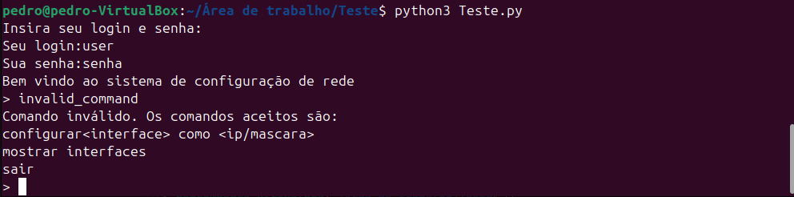
    
### 2.2.2 Scenario: Configuration with an invalid subnet mask
- **Given** The user is logged into the system
- **When** The user executes the command "configurar enp0s3 como 192.168.0.1/33"
- **Then** The user sees the error message "IP inválido: Fora do padrão"

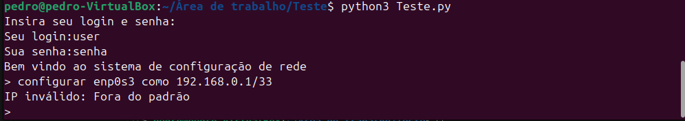

### 2.2.3 Scenario: Configuration with an invalid IP format
- **Given** The user is logged into the system
- **When** The user executes the command "configurar enp0s3 como 192.168.1"
- **Then** The user sees the error message "IP inválido: Fora do padrão"

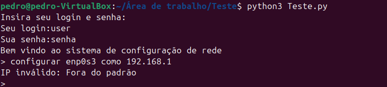

### 2.2.4 Scenario: Configuration with a byte outside the valid range
- **Given** The user is logged into the system
- **When** The user executes the command "configurar enp0s3 como 192.300.0.1/24"
- **Then** The user sees the error message "IP inválido: Pelo menos um dos bytes é menor que 0 ou maior que 255"

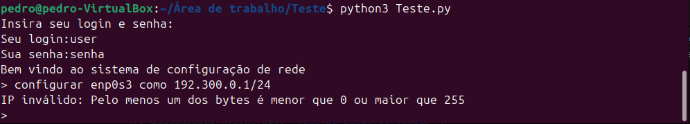